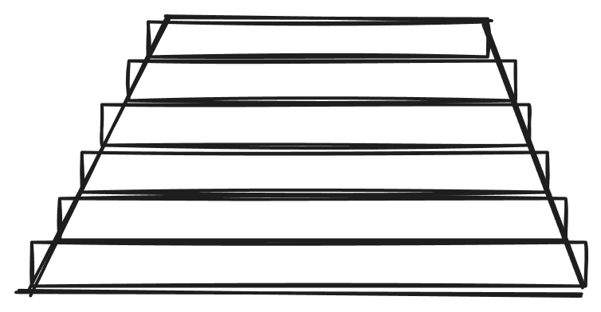

# RCWA 求解器简介

严格耦合波分析 （RCWA） 求解器可用于分析入射到多层结构上的平面波的光学响应。
RCWA 求解器可用于在层几何结构中具有周期性变化的结构，例如光子晶体和衍射光栅。
RCWA 求解器的仿真时间通常比 FDTD 短得多，因此是分析这些类型的周期性结构的理想工具。

该项目基于C++编写，使用数学库Armadillo实现矩阵运算，使用FFTW3计算二维卷积矩阵。
器件结构和仿真所需参数的输入文件在Input目录，仿真结果的输出文件在Output目录。

## 原理
RCWA 方法是一种半解析技术，用于求解多层结构中的麦克斯韦方程组。在这种方法中，结构沿传播方向被分成一系列均匀的层。沿传播方向具有逐渐变化的横截面的结构可以用一系列均匀的层来近似。例如，在下面显示的几何结构中，梯形形状（左）近似为一系列五层（右）：



 增加截面上的层数可以提高模拟的精度，但会增加模拟时间。

 将结构划分为多个层后，麦克斯韦方程组将在傅里叶域的每一层中解析求解。傅里叶模式的波矢称为 k 矢量。由于结构的周期性，只允许使用离散的 k 向量。增加 k 向量的数量可以提高精度，但代价是仿真时间增加。

 然后，每个部分的解双向传播，以计算整个器件的 S 矩阵。计算出 S 矩阵后，来自入射平面波的光就可以传播到结构中。由于几何形状的周期性，入射平面波被衍射成一组有限的平面波，称为“光栅级”。
 计算 S 矩阵后，可以计算出传输和反射的入射功率分数、每个光栅阶数的功率以及结构内部的电场和磁场等结果。
## 建模


Note: 平面波的传播轴为z轴，沿着z轴正向传播。

```
tree /f > filename 
```

关于Input文件夹的数据介绍

| 名称 | 含义|
|---|---|
| ku | x方向最大谐波  | 
| kv | y方向最大谐波  |
 | lambda | 波长  |
 | LayerPos| 每一层中心z坐标|
 | n_lower  | 入射区域的折射率|
|   n_upper  |反射区域折射率|
| phi  | 入射平面波旋转角|
| theta | 入射角| 
| x  |横向x网格坐标|
| y |横向y网格坐标|
| z | z向分层坐标|
|Index_real_z_i_j | 第i层第j个波长的实折射率|
|Index_imag_z_i_j| 第i层第j个波长的虚折射率|


 

## 使用


## 案例


## 总结